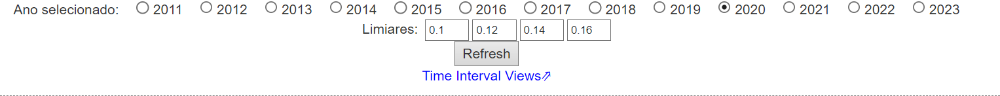
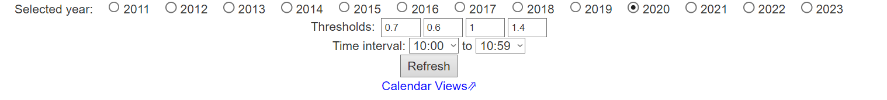
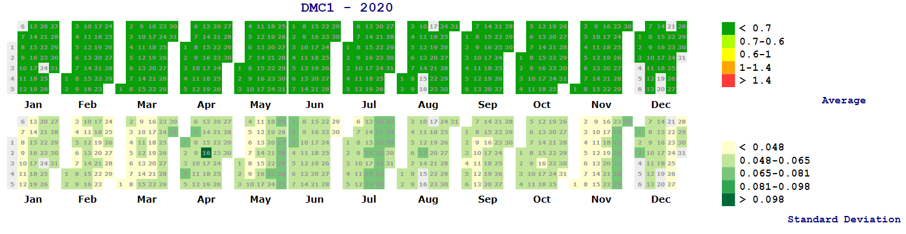

# 8. Calendars

* * *

This function allows the visualization of the time series of scintillation monitoring data through a general perspective. Generating calendars mainly for the averaged daily value of the S4 index.

 - We have two variations of this function: 

    1. **Calendar View:** generates calendars indicating the average value of s4 on each day; 

    1. **Calendar time interval view:** generates calendars indicating the daily average and standard deviation of total S4 only in the time interval indicated by the user.

*Gray cells indicate absence of data*

*Calendars are generated for each single station*

* * *

## **8.1 Calendar View**

The user must select the year to be visualized and the thresholds for displaying the information 

*Figure 8.1.1 - Inputs*

*Figure 8.1.2 - Output*

* * *

## **8.2 Time Interval View**

In addition to the year to be displayed and the thresholds for displaying the information, the user also indicates the desired time interval.

 - *The standard deviation thresholds are dynamically set*

*Figure 8.2.1 - Inputs*

*Figure 8.2.2 - Output*
