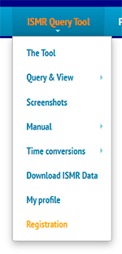

# Getting Started

* * *

##**Accessing the Tool**

&nbsp;&nbsp;&nbsp;&nbsp; **Steps:**

 **1.** To access the Tool a request to sign up is needed, identifying yourself and justifying the need for access.

*Sign up option*

 **2.** After the registration is validated, simply log in and the access to the functions will be released.

*Login Screen*
 

*Functions Avaliable*

* * *

##**Using the Tool**

Database have billions of observations, so the user must to filter subsets of data when querying due to operational aspects. The receivers provide more than 60 parameters. It is possible to combine any of them while queryng through the filters usage.

- ##ISMR Data Request
Download data directly from the ISMR data table,
this service demands one HTTP request by **station**. It returns all ISMR data tracked at the given time window.

###*Parameters*
1. If presented in plain text, the most of them, are mandatory.
1. If presented between brackets *( )* are optional and also independent from other parameters.

**Parameter** | **Description** | **Example(s)**
---|---|---
date_begin | Start date/time of the dataset. Format **YYYY-MM-DD hh : mm :ss** | 2014-10-01 22:00:00
date_end | End date/time of the dataset. Format **YYYY-MM-DD hh : mm :ss** | 2014-10-01 22:05:00
(stationName) | String station name **(XXXX)** to be retrieved. Use only if station is omitted. | PRU1
(station) | Single numeric station **id** to be retrieved. Use only if *stationName* is omitted. | 5 

###*In the tool*

* * *

## **Some initial parameters**

*Some of the functions will have as start Filters:*

1. **Date/time interval(UTC):** Time interval of the dataset.

1. **Station(s):** There are eight fixed stations distributed in Brazil. Some experimental and temporary stations can also be consulted. The user can select All stations , a single station or a subset of stations whith the names of them in a comma separeted list.

1. **Satellites(s):** The satellite constellation to be used. The user can select All constellations or just a single constellation.

1. **S4:** Amplitude scintillation index. The user can specify an interval or a specific value.

1. **Elevation angle:** Angle of the signal. The user can specify an interval or a specific value.

1. **Custom Filters:** Beyond the fields fixed on interface, the other fields can be selected in a list. After set the parameters of the filter, the user must click the "+" button to add the filter. So more custom filters can also be added in the query.

#

###*How it looks*

###*Functions that use these inputs:*
1. Plot
1. Grid
1. IPPMap
1. SAX
1. Correlation Analysis
1. Sky Plot

