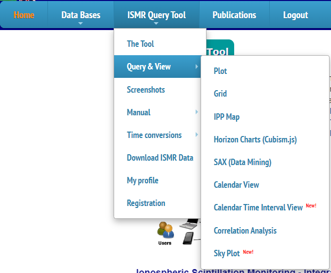

# Getting Started

* * *

##**Accessing the Tool**

&nbsp;&nbsp;&nbsp;&nbsp; **Steps:**

 **1.** To access the Tool a request to sign up is needed, identifying yourself and justifying the need for access.

*Sign up option*

 **2.** After the registration is validated, simply log in and the access to the functions will be released.

*Login Screen*

*Functions Avaliable*

* * *

##**
