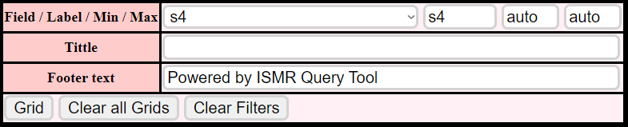
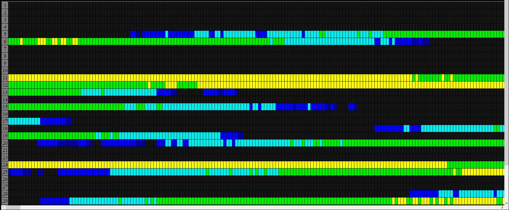

---
hide:
  - navigation
  - toc
---

# Grid

* * *

Here you can generate a list of scintillation values according to the defined fields and the desired time interval.

* * *

*Inputs*

 - *The details of the fields are specified in the "Attributes" tab*

*Output*

*The data is loaded into each grid cell, to show it just hover the cursor over it and you will see something like this:*

>"Epoch" refers to the selected time interval

>"SVID" identifies the satellites

>"Elev" checks the angle of elevation

>"S4"(the field selected to filter the data) indicates the value of the scintillation index 
