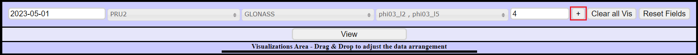

---
hide:
  - navigation
  - toc
---

# 6. Horizon Charts

* * *

This function allows the users to analyze several time series of monitoring attributes simultaneously through a visual representation combining positions and colors, setting the period on the x-axis and the selected filters on the y-axis

* * *

## **6.1 Parameters**

The users must select:

 - Date
 - Station(s)
 - Satellite Constellation(s)
 - Monitoring indices (Fields)
 - Elevation Cutoff

*Figure 6.1.1 - Inputs*

* * *

## **6.2 Generating the chart**

After setting the filters, just click o the plus button to load the data into the visualization area.

*Figure 6.2.1 - Add Filter*

Now you can see all the data that are according to the indicated filters, the order in which they are will be the same when generating the chart, to change it just drag and drop. It is also possible to delete unwanted data from the visualization using the *del* button.

*Figure 6.2.2 - Data*

After that, just click on *view* and the chart will be generated.

*Figure 6.2.3 - View*

*Figure 6.2.4 - Output*

