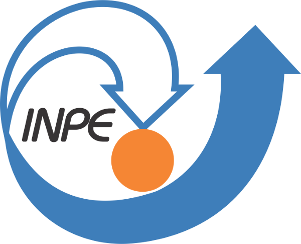

# Overview 

 

__*Ionospheric Scitillation Monitor Receiver Query Tool*__

* * *
Manual for version: **v1.1**

*Please, do not use this service to feed third part applications.*

* * *

ISMR Query Tool general objective is to apply data visualization and data mining techniques allowing you to perform queries and some analysis on scintillation monitoring indexes from 
eight GNSS receivers distributed in Brazil for the CIGALA Project.
It works with HTTP GET requests, therefore granting interoperability with any programming language (like Matlab, R, C, Java, JavaScript, etc) or utility (wget, curl, etc).

After logging in as an authorized researcher, collaborator or staff member, the tool's functions will be accessible in the "Query & View" tab.

* * *

##**Tested and Supported browsers**
- Mozilla Firefox - Version 11
- Google Chrome - Version 17.0.963.79
- Opera GX Browser

* * *

##**Software Suite**

**Database Management System (DBMS)**

- [PostgreSql (v9.0)](https://www.postgresql.org){:target="_blank"}

**Tools for Receivers**

- [Septentrio RxTools](https://www.septentrio.com/en/products/gps-gnss-receiver-software/rxtools){:target="_blank"}

- [teqc](https://www.unavco.org/software/data-processing/teqc/teqc.html){:target="_blank"}

**Web Interface**

- Web Server: [Apache (v2.2.17)](https://www.apache.org){:target="_blank"}
- Server-side scripting language: [PHP (v5.3.5)](https://www.php.net){:target="_blank"}
- Client-side scripting languages: Javascript and jQuery

**Plotations**

- [PHPlot (v5.4.0)](http://phplot.org){:target="_blank"}

**Map**

- Gif creation: [GMT(v4.5.7)](https://www.generic-mapping-tools.org){:target="_blank"}
- Gif animation: [Image Magick](https://imagemagick.org/index.php){:target="_blank"}
- Sattellites map: [MapServer (v5.6)](https://mapserver.org){:target="_blank"}

* * *

##**Sponsors**

    

        
    

    

        
    

    

        
    

    

        
    

    

        
    

    

        
    

    

        
    

    

        
    

    

        
    

* * *

##**Last Updates**
- 2012-04-30: Beta version is now available at home page!
- 2012-07-03: New version! Main features: queries optmized; rinex creation; tooltips; IPP maps.

* * *

##**Team**

*Developer:* Bruno Cesar Vani

*Advisors:* Milton Hirokazu Shimabukuro and Joao Francisco Galera Monico

*Contributors:* Marco Aurelio M. de Mendonca, Rogerio T. Oyama, Daniele Barroca, Fabricio Prol, Heloisa Alves da Silva and [GEGE](https://www.fct.unesp.br/#!/pesquisa/grupos-de-estudo-e-pesquisa/gege/home){:target="_blank"} members.

