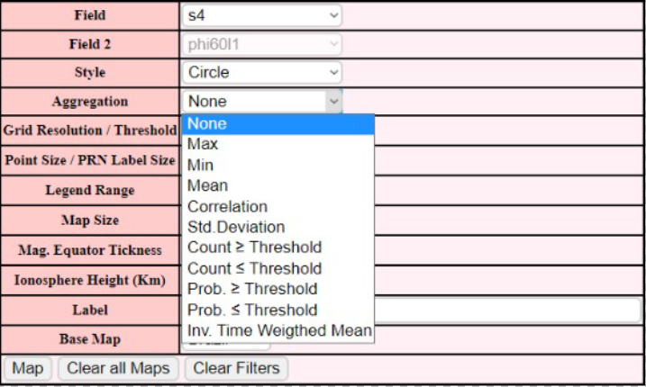
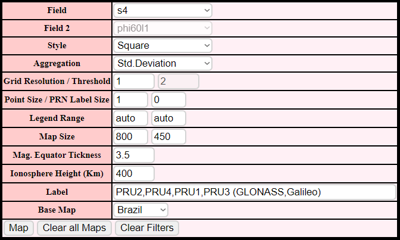
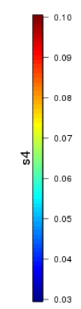
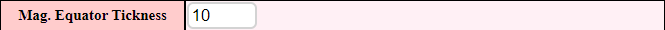

# Ionospheric Pierce Points (IPP) Map

* * *

This function considers both spatial and temporal domains, using the Ionospheric Pierce Point concept to represent the ISMR data according to the declared parameters on a map,
projecting the IPP path over the selected time interval using aggregation methods.

* * *

*After selecting the initial parameters, such as the time interval, the user can set as output parameters:*

* * *

## **Field**

Here the user selects the field that will be considered when generating the map along with the custom filters chosen earlier.

* * *

## **Style**

Define how the points will be displayed on the map

*Circle*

*Square*

* * *

## **Aggregation**

Aggregation consists in a way to summarize a comprehensive dataset using specific methods.

*Examples:*

=== "Without Aggregation"

    *Inputs:*

    

    *Output:*

    

=== "With Aggregation by Standard Deviation"

    *Inputs:*

    

    *Output:*

    

* * *

## **Grid Resolution / Threshold**

Projection IPP Resolution according to the aggregation selected.

* * *

## **Point Size / PRN Label Size**

- Point Size:

    Size of the displayed points 

- PRN Label Size:

    Display size of the Pseudorandom number of the satellite from which the data was collected

*Example with PRN Label Size as 1*

 

* * *

## **Legend Range**

Defines the range of values collected for the selected field that will be indicated by the legend

*Example:*

*Input*

*Output*

* * *

## **Map Size**

Map size in the output (Width x Height)

* * *

## **Magnetic Equator Tickness**

Defines the Tickness of the line that represents the Magnetic Equator in the map

