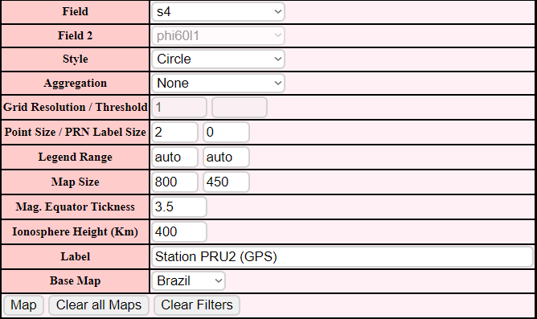

# Ionospheric Pierce Points (IPP) Map

* * *

This function considers both spatial and temporal domains, using the Ionospheric Pierce Point concept to represent the ISMR data according to the declared parameters on a map,
projecting the IPP path over the selected time interval using aggregation methods.

* * *

*After selecting the initial parameters, such as the time interval, the user can set as output parameters:*

* * *

## **Field**

Here the user selects the field that will be considered when generating the map along with the custom filters chosen earlier.

* * *

## **Style**

Define how the points will be displayed on the map

*Circle*

*Square*

* * *

## **Aggregation**

Aggregation consists in a way to summarize a comprehensive dataset using specific methods.

*Examples:*