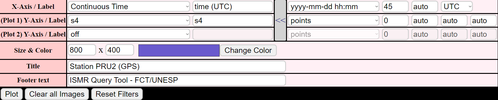
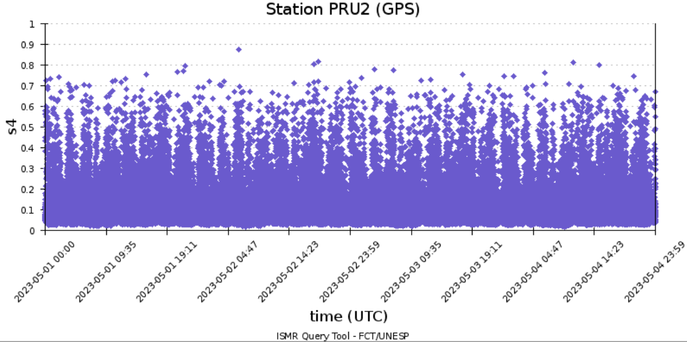
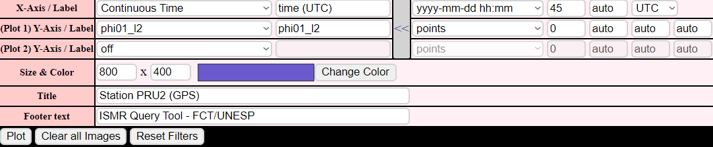
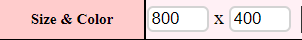
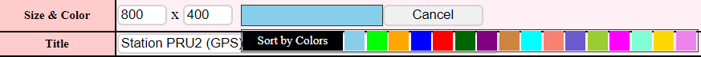

# Plot

* * *

This function makes it possible to analyze time series of monitoring attributes, allowing the user to identify duration and peaks
of scintillation, as well as visually identify the most affected satellites with the time attribute being represented along the x-axis.
 
* * *

After entering the initial parameters, the user can set some specific filters for plotting.

 - *The tool auto suggest labels and output parameters for plottings, but the user can change the filters manually. There are also some specific parameters for analysis.*

* * *

## **X-Axis/Label**
There are two options of time distribuition and the user can set labels for them.

 - **Continuous Time:** Data are arranged in a continuous time line according to the selected time interval

Example:

*Inputs:*

*Output:*

 - **Grouped by time of day [0h-24h]:** Data are arranged by the same time of days (from 0h00 to 23h59). This option allows the user to identify which hours of day are more affected by scintillation (time is given in GNSS time, not in local time).

Example:

<!-- *Inputs:* -->

<!-- -->
<!-- --> 

*Output for the same inputs but now grouped by time of day:*

* * *

## **Y-Axis and Labels**
The user can choose one or two parameters (from more than 60) to be plotted at some query, as well as styles for them. The most used and appropriate style is "points" (default), but "lines" and "linepoints" are also available.

Example:

*Inputs:*

*Output:*

* * *

## **Size**
The size of image is given by width and height. In some cases, the system automatically adjusts this option for assure correct plotting.

* * *

## **Colors**
There are two options of color sort.

 - Single color: The user select a color to the plot in the pallete
 
 Example:

 
 

 - Sort by colors:

 

&nbsp;&nbsp;&nbsp;&nbsp;&nbsp;&nbsp;I. *If all (or a subset) stations was set in the "station" filter, the tool will arrange all of the stations by colors and legend:*

&nbsp;&nbsp;&nbsp;&nbsp;&nbsp;&nbsp;II. *If just one station was set in "station" filter, the tool will arrange the satellites by colors instead:*

* * *

## **Title and Footer**
The label and footer can be set by the user and will be disposed above and below the plot.

